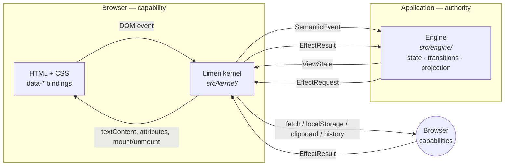

# Limen

**An explicit boundary that keeps browser capabilities separate from
application authority.**

*Limen* (Latin): a threshold — the stone at the base of a doorway. Your
application stands behind it. The browser stands in front of it. Nothing
crosses except plain, serializable data.

```sh
npm install @echelon-foundry/typescript-wasm-kernel
```

| | |
| --- | --- |
| **Five-minute start** | [docs/quick-start.md](https://github.com/kemiller2002/typescript-wasm-kernel/blob/main/docs/quick-start.md) |
| **Who owns what** | [docs/mental-model.md](https://github.com/kemiller2002/typescript-wasm-kernel/blob/main/docs/mental-model.md) |
| **Where does my change go?** | [docs/where-code-goes.md](https://github.com/kemiller2002/typescript-wasm-kernel/blob/main/docs/where-code-goes.md) |
| **I am an AI coding agent** | [AGENTS.md](https://github.com/kemiller2002/typescript-wasm-kernel/blob/main/AGENTS.md) |

---

## What it is

A dependency-free browser library that splits a web application in two:

- **The kernel** runs in the browser and does browser things — DOM bindings,
  `fetch`, `localStorage`, the clipboard, history. It understands six HTML
  attributes and **no application vocabulary at all**.
- **The engine** owns everything that means something — state, transitions,
  validation, what the user is allowed to do, what to show.

They communicate only through plain JSON-serializable data. The engine never
touches a browser API; the kernel never learns what your data means.

The same npm package also ships a **lifecycle CLI** — `init`, `status`,
`verify`, `upgrade`, `doctor` — which installs that boundary into a repository
and keeps it honest.

### Three things newcomers ask first

1. **Where is the WebAssembly?** The **npm package is still a TypeScript browser
   boundary** and does not ship a WASM application engine. The repository now
   contains two real F#/.NET WebAssembly consumers of that boundary: the Limen
   product site under `site/fsharp/`, and the separate
   `time-entry-state-machine` application. The deployed Limen site therefore
   demonstrates the seam rather than merely describing it. Full status:
   [docs/17-wasm-migration.md](https://github.com/kemiller2002/typescript-wasm-kernel/blob/main/docs/17-wasm-migration.md).
2. **Is Limen written in F#?** The **browser kernel and protocol are
   TypeScript**. The lifecycle CLI is F#. The product site's application state,
   transitions, evidence handling, capabilities and projection are also F#,
   compiled to WebAssembly. A tiny C# `[JSExport]` file exists only as .NET
   marshalling glue; it contains no application decision.
3. **Why is the package named `typescript-wasm-kernel`?** History. Limen is the
   product name; **no exported symbol, file path, or protocol type was
   renamed**, and nothing was deprecated. See
   [docs/18-naming-and-compatibility.md](https://github.com/kemiller2002/typescript-wasm-kernel/blob/main/docs/18-naming-and-compatibility.md).

## Why it exists

Most browser applications end up with the same problem: the truth about what
the application is doing gets smeared across three places — a JavaScript store,
the DOM itself, and the server. Each can disagree with the others, and no
single file tells you which is right.

Limen takes a different position: **exactly one place owns application state,
and it is not the browser.**

| Property | What Limen actually supplies |
| --- | --- |
| Explicit application authority | The contract gives the engine one place to publish application state and decisions. A compliant application treats the DOM as projection output, not as a second source of truth. |
| Explicit effects and uncertainty | Browser I/O crosses as typed requests/results, including `OutcomeUnknown` where the browser cannot honestly call an effect success or failure. |
| Portable engine seam | `EngineTransport` carries serializable data only. The site and an external time-entry consumer both demonstrate F#/.NET WASM engines behind it. |
| Centralized browser authority | HTTP, storage, clipboard and navigation mechanisms live in the kernel rather than application transitions. |
| Small browser-facing audit surface | The reference engine is mechanically checked for forbidden browser APIs; consumers can apply the same rule. |
| Strong domain modelling is possible, not automatic | F# or a typed TypeScript engine can make illegal domain states unrepresentable and transitions pure. **Limen does not manufacture that domain model for you.** |

These are architectural properties or existence proofs, not measured claims
about speed, defects, agent accuracy, tokens or cost — see [Evidence](#evidence).
The mechanically enforced reference-engine boundary is:
[`scripts/check-architecture.ts`](https://github.com/kemiller2002/typescript-wasm-kernel/blob/main/scripts/check-architecture.ts)
fails the build if `src/engine/**` so much as mentions `document`, `window`,
`fetch(`, `localStorage`, or `sessionStorage`.

## Core architecture

```text
HTML / CSS / browser APIs
          │
          ▼
        Limen            ← the threshold: carries data, decides nothing
          │
          ▼
  Application engine
  state · transitions · decisions
```

In more detail:



One full interaction, step by step:

```text
DOM event  →  Limen  →  SemanticEvent  →  transition()  →  new state
                                                            │
                                      effect needed? ───────┤
                                                            ▼
                                                    EffectRequest
                                                            │
                                                          Limen
                                                            │
                                                   browser capability
                                                            │
                                                       EffectResult
                                                            │
                                                       transition()
                                                            ▼
                                                     project() → ViewState
                                                            │
                                                          Limen
                                                            ▼
                                                        the DOM
```

The two arrows crossing the middle are the entire contract. They are defined in
[`src/protocol.ts`](https://github.com/kemiller2002/typescript-wasm-kernel/blob/main/src/protocol.ts) —
about 160 lines, and the single most useful file to read.

Three complete interactions traced through every file they touch:
[docs/traces.md](https://github.com/kemiller2002/typescript-wasm-kernel/blob/main/docs/traces.md).

## Install

```sh
npm install @echelon-foundry/typescript-wasm-kernel
```

No runtime dependencies. Node ≥ 22 to build or test; any browser with ES2022
modules, `fetch` and `AbortController` to run.

## The smallest working example

Three files. Nothing elided.

**`index.html`** — structure and bindings:

```html
<button data-event="increment">Add one</button>
<button data-event="reset" data-bind-disabled="resetDisabled">Reset</button>
<p>Count: <span data-text="count">0</span></p>

<script type="module" src="./main.js"></script>
```

**`engine.ts`** — all the meaning:

```ts
import type { BrowserToEngineMessage, EngineToBrowserMessage, EngineTransport, ViewState }
  from "@echelon-foundry/typescript-wasm-kernel/protocol";

type State = { readonly count: number };

// Pure. No DOM, no fetch, no globals.
const transition = (state: State, name: string): State => {
  switch (name) {
    case "increment": return { count: state.count + 1 };
    case "reset":     return { count: 0 };
    default: throw new Error(`Unrecognized event: ${name}`);
  }
};

// Pure. Produces what the view needs — including whether Reset is *allowed*.
const project = (state: State): ViewState => ({
  count: state.count,
  resetDisabled: state.count === 0,
});

export function createCounterTransport(): EngineTransport {
  let state: State = { count: 0 };
  return {
    async start() {},
    async dispatch(message: BrowserToEngineMessage): Promise<EngineToBrowserMessage> {
      if (message.kind === "Event") state = transition(state, message.event.name);
      return { view: project(state), effects: [], cancellations: [] };
    },
  };
}
```

**`main.ts`** — the wiring, in full:

```ts
import { BrowserKernel } from "@echelon-foundry/typescript-wasm-kernel";
import { createCounterTransport } from "./engine.js";

await new BrowserKernel(createCounterTransport(), document).start();
```

A click becomes `SemanticEvent { name: "increment" }`, `transition` returns a
new state, `project` turns it into `{ count: 1, resetDisabled: false }`, and the
kernel writes `1` into the `<span>` and enables the button.

Note `resetDisabled`. The engine decides whether Reset is available; the DOM
never re-derives it from the number on screen. That habit — **project
capabilities, don't reconstruct them** — is most of what using Limen well
consists of.

This example is real, and the test suite executes it on every run:
[`examples/01-counter/`](https://github.com/kemiller2002/typescript-wasm-kernel/tree/main/examples/01-counter).
A no-build-step JavaScript copy ships **inside the npm package** at
`examples/minimal/`.

## How state works

- **One place owns it**: your engine. Not the DOM, not a store, not a module
  variable.
- **It is a discriminated union**, so combinations that make no sense cannot be
  written down.
- **Transitions are pure**: `(state, command) → { state, effects, accepted }`.
  An illegal command is *refused explicitly* and says so, rather than throwing
  or quietly working.
- **The view is a projection**, `project(state) → ViewState`: plain named
  values and lists. It includes what the UI is *allowed* to do, so the DOM never
  works that out for itself.
- **Nothing persists by itself.** A reload starts from your initial state
  unless your engine asked for a `Storage` effect.

Detail: [docs/04-state-model.md](https://github.com/kemiller2002/typescript-wasm-kernel/blob/main/docs/04-state-model.md).

## How browser capabilities work

The engine never performs an effect. It **describes** one; the kernel performs
it and reports a typed outcome, which the engine then treats as evidence.

| Capability | Operations | Outcomes |
| --- | --- | --- |
| `Http` | any method, your headers and body, a required timeout | `Success` · `Failure` · `Cancelled` · `OutcomeUnknown` |
| `Storage` | `get` / `set` / `remove` on `localStorage` | `Success` · `Failure` |
| `Clipboard` | `writeText` (read is deliberately absent) | `Success` · `Failure{denied, unavailable, unknown}` |
| `Navigation` | `push` / `replace` / `back` / `forward` | `Success{location}` · `Dispatched` · `Failure` |

**`Clipboard` and `Navigation` are new in 0.6.1.** On an earlier version they do
not exist, and requesting one produces a `BridgeError` with `phase: "effect"`
and no result. Check with `npm ls @echelon-foundry/typescript-wasm-kernel`; the
per-version record is [CHANGELOG.md](https://github.com/kemiller2002/typescript-wasm-kernel/blob/main/CHANGELOG.md).

Plus one message nobody requested: **`LocationChanged`**, when the user presses
Back or Forward. It is not an effect result, because no effect was asked for.

`OutcomeUnknown` is the one people skip, and the reason the set is worth having:
a timed-out request **may already have reached the server**. A POST that times
out must not be retried automatically, and no type that collapses that into
"failed" can tell you so.

Not implemented: files, timers, focus control, geolocation, `IndexedDB`,
clipboard read. Adding one is a deliberate protocol change —
[docs/15-recipes.md](https://github.com/kemiller2002/typescript-wasm-kernel/blob/main/docs/15-recipes.md).

Detail: [effects and browser interop](https://github.com/kemiller2002/typescript-wasm-kernel/blob/main/docs/07-effects-and-browser-interop.md) ·
[routing](https://github.com/kemiller2002/typescript-wasm-kernel/blob/main/docs/routing.md) ·
[clipboard](https://github.com/kemiller2002/typescript-wasm-kernel/blob/main/docs/clipboard.md).

## F# and this repository

Being precise, because this is the most common misunderstanding:

| Part | Language | Status |
| --- | --- | --- |
| Browser kernel + protocol (`src/kernel/`, `src/protocol.ts`) | TypeScript | shipped in the npm package |
| Reference engine (`src/engine/`) | TypeScript | shipped for examples/reference use |
| Lifecycle CLI (`cli/Limen.Core/`, `cli/Limen.Cli/`) | **F#** | shipped as self-contained platform binaries |
| Product-site application engine (`site/fsharp/Limen.Site.Engine/`) | **F#** | compiled to .NET WebAssembly and used by this site's interactive pages |
| Product-site WASM host | tiny C# marshalling shim | one `[JSExport]`; no state or application rule |
| Product-site browser mechanics | TypeScript | `BrowserKernel` + a loader/JSON transport only |

The important distinction is not "TypeScript versus F#." It is
**mechanism versus authority**. Limen's browser side remains generic while the
application engine may be TypeScript, F#, or another language behind
`EngineTransport`.

The product site is now an in-repository existence proof of that seam. Its F#
engine owns release legality, evidence, stale-result rejection, reconciliation,
the placement challenge, and projection. The browser-side site code owns none
of those concepts.

See
[docs/17-wasm-migration.md](https://github.com/kemiller2002/typescript-wasm-kernel/blob/main/docs/17-wasm-migration.md)
for the exact implementation and remaining limits.

## Examples

Each is executed by
[`test/examples.test.ts`](https://github.com/kemiller2002/typescript-wasm-kernel/blob/main/test/examples.test.ts)
against its own real `index.html`, so none can silently rot. Every one has a
README covering its state model, event and effect flow, exercises, and the
mistakes people actually make with it.

| Example | Demonstrates |
| --- | --- |
| [01-counter](https://github.com/kemiller2002/typescript-wasm-kernel/tree/main/examples/01-counter) | the minimum: event → transition → projection → DOM |
| [02-form](https://github.com/kemiller2002/typescript-wasm-kernel/tree/main/examples/02-form) | validation, capability projection, rejected illegal transitions |
| [03-fetch-data](https://github.com/kemiller2002/typescript-wasm-kernel/tree/main/examples/03-fetch-data) | HTTP effect, lists, all four outcomes, stale-result rejection |
| [04-save-data](https://github.com/kemiller2002/typescript-wasm-kernel/tree/main/examples/04-save-data) | full save lifecycle, storage effect, non-idempotent write safety |
| [05-multi-screen](https://github.com/kemiller2002/typescript-wasm-kernel/tree/main/examples/05-multi-screen) | screens as state, shared vs. screen-local lifetimes, no URLs |
| [06-time-entries](https://github.com/kemiller2002/typescript-wasm-kernel/tree/main/examples/06-time-entries) | a realistic feature: load, validate, add, mutate, refresh |
| [07-clipboard](https://github.com/kemiller2002/typescript-wasm-kernel/tree/main/examples/07-clipboard) | copying text; three failure reasons, only one worth retrying |
| [08-routing](https://github.com/kemiller2002/typescript-wasm-kernel/tree/main/examples/08-routing) | typed routes, deep links, Back and Forward, static hosting |
| [minimal](https://github.com/kemiller2002/typescript-wasm-kernel/tree/main/examples/minimal) | the copy shipped inside the npm package — four files, no build step |
| [kitchen-sink](https://github.com/kemiller2002/typescript-wasm-kernel/tree/main/examples/kitchen-sink.html) | every primitive and every outcome, interactively |

## Documentation

| You are… | Start here |
| --- | --- |
| Getting something working now | [quick-start](https://github.com/kemiller2002/typescript-wasm-kernel/blob/main/docs/quick-start.md) |
| Trying to understand the model | [mental model](https://github.com/kemiller2002/typescript-wasm-kernel/blob/main/docs/mental-model.md) |
| Deciding where a change belongs | [where does code go?](https://github.com/kemiller2002/typescript-wasm-kernel/blob/main/docs/where-code-goes.md) |
| Following one interaction end to end | [three traces](https://github.com/kemiller2002/typescript-wasm-kernel/blob/main/docs/traces.md) |
| Looking for an API | [API reference](https://github.com/kemiller2002/typescript-wasm-kernel/blob/main/docs/11-api-reference.md) |
| Doing one specific task | [recipes](https://github.com/kemiller2002/typescript-wasm-kernel/blob/main/docs/15-recipes.md) |
| Debugging | [troubleshooting](https://github.com/kemiller2002/typescript-wasm-kernel/blob/main/docs/16-troubleshooting.md) |
| Adding URLs | [routing](https://github.com/kemiller2002/typescript-wasm-kernel/blob/main/docs/routing.md) |
| Copying text | [clipboard](https://github.com/kemiller2002/typescript-wasm-kernel/blob/main/docs/clipboard.md) |
| About to do it wrong | [anti-patterns](https://github.com/kemiller2002/typescript-wasm-kernel/blob/main/docs/13-anti-patterns.md) |
| Adopting Limen elsewhere | [integration guide](https://github.com/kemiller2002/typescript-wasm-kernel/blob/main/docs/10-integration-guide.md) |
| Using the CLI | [lifecycle CLI](https://github.com/kemiller2002/typescript-wasm-kernel/blob/main/docs/20-lifecycle-cli.md) |

Full index:
**[docs/README.md](https://github.com/kemiller2002/typescript-wasm-kernel/blob/main/docs/README.md)**.
Live site: **<https://kemiller2002.github.io/typescript-wasm-kernel/>**.

## For agents

Start at
**[AGENTS.md](https://github.com/kemiller2002/typescript-wasm-kernel/blob/main/AGENTS.md)**.
It opens with the non-negotiable rules, then gives a deterministic reading
order, repository landmarks with real paths, a placement decision tree, and a
list of mistakes agents actually make here.

The three documents that answer most placement questions on their own:
[mental model](https://github.com/kemiller2002/typescript-wasm-kernel/blob/main/docs/mental-model.md),
[where does code go?](https://github.com/kemiller2002/typescript-wasm-kernel/blob/main/docs/where-code-goes.md),
[three traces](https://github.com/kemiller2002/typescript-wasm-kernel/blob/main/docs/traces.md).

Deeper guidance:
[agent guide](https://github.com/kemiller2002/typescript-wasm-kernel/blob/main/docs/14-agent-guide.md).

## The npm package

```sh
npm install @echelon-foundry/typescript-wasm-kernel
```

What you receive:

| | |
| --- | --- |
| Entry points | `.` (kernel + types), `./protocol`, `./kernel`, `./reference-engine` |
| Types | `.d.ts` for everything, with source maps |
| Executables | `limen` (and `typescript-wasm-kernel`) — the lifecycle CLI |
| Documentation | `README.md`, `CHANGELOG.md`, `LICENSE`, and `docs/`: quick start, mental model, where-code-goes, API reference, troubleshooting, glossary |
| A complete example | `examples/minimal/` — four files, no build step |
| Runtime dependencies | **none** |

The packaged docs describe **the version you installed**. The copies on GitHub
describe `main`, which may be ahead.

The tarball's contents are verified on every run of `npm run check` against an
expected manifest, and a clean-room job installs the packed tarball into an
empty project and builds the minimal example from it — so "it works in the
repository" is never mistaken for "it works when installed".

## The lifecycle CLI

The same package is also a command-line tool that installs the Limen boundary
into a repository and keeps it honest. No .NET runtime is required — a
self-contained binary ships for each supported platform.

```sh
npx @echelon-foundry/typescript-wasm-kernel init      # install the boundary. Idempotent.
npx @echelon-foundry/typescript-wasm-kernel status    # what is installed, and is it valid?
npx @echelon-foundry/typescript-wasm-kernel verify    # check it. Read-only.
npx @echelon-foundry/typescript-wasm-kernel upgrade   # move to this version, safely.
npx @echelon-foundry/typescript-wasm-kernel doctor    # explain what is wrong, and how to fix it.
```

Once installed, the executable is simply `limen`.

`init` creates three things: `limen.config.json` (yours — it names which
directories are engine and which are kernel), a CI workflow that runs
`verify --strict`, and an installation manifest at `.echelon/limen.json`. It
never overwrites a file you have edited, and never overwrites a file that was
there before it arrived. Running it twice makes no second round of changes.

`verify` then enforces the boundary this README opens with: engine code must not
name `document`, `window`, `fetch(`, `localStorage` or `sessionStorage`, and
neither side may use `eval`. It is a lexical check — a guard rail, not a proof.

For CI and agents, every command takes `--json` and branches on stable exit
codes; `init` and `upgrade` take `--dry-run` and `--check`. Nothing prompts, so
nothing hangs.

Full reference:
**[docs/20-lifecycle-cli.md](https://github.com/kemiller2002/typescript-wasm-kernel/blob/main/docs/20-lifecycle-cli.md)**.
What it writes and what an upgrade may change:
**[docs/21-installation-and-upgrade.md](https://github.com/kemiller2002/typescript-wasm-kernel/blob/main/docs/21-installation-and-upgrade.md)**.

The CLI is implemented in F# (`cli/Limen.Core/`, `cli/Limen.Cli/`); the Node
side is a launcher that selects a binary and forwards arguments, and contains no
lifecycle logic.

## Compatibility

- **Node** ≥ 22 to build and test (the published package is browser code)
- **TypeScript** ≥ 5.9 if you consume the types
- **Browsers**: any with ES2022 modules, `fetch`, and `AbortController`.
  The clipboard capability additionally requires a **secure context**
  (`https://` or `localhost`)
- **Runtime dependencies**: none — the kernel imports nothing at runtime
- **The CLI**: needs no .NET runtime; a self-contained binary ships for Linux
  x64/arm64, Windows x64, and macOS x64/arm64. Any other platform exits `7`
  saying so. Building it from source needs the **.NET SDK 8** and **F# 8**.
- **WASM**: not required by the npm kernel. This repository's product site does
  use .NET WebAssembly for its F# application engine. Consumers may use the
  in-process TypeScript reference engine or provide another `EngineTransport`.
  See [docs/17-wasm-migration.md](https://github.com/kemiller2002/typescript-wasm-kernel/blob/main/docs/17-wasm-migration.md).
- **Versioning**: semver, currently `0.x` — the protocol may still change in a
  minor release. See
  [stability and compatibility](https://github.com/kemiller2002/typescript-wasm-kernel/blob/main/docs/11-api-reference.md#stability-and-compatibility).

## The site

Limen's own website is built **with** Limen — its interactive sections are a
real Limen application driven by the same package you would install, and its
prose is ordinary static HTML. Source in
[`site/`](https://github.com/kemiller2002/typescript-wasm-kernel/tree/main/site),
deployed by
[`.github/workflows/pages.yml`](https://github.com/kemiller2002/typescript-wasm-kernel/blob/main/.github/workflows/pages.yml).

```sh
npm run serve:site   # build and serve on http://localhost:4174
```

The release demo performs real Limen HTTP requests for success and network
failure. Its timeout-after-dispatch control injects an already-classified
`OutcomeUnknown` into the F# engine so the recovery path is deterministic on a
static Pages site; the kernel's timeout classification itself is covered by
kernel tests. The stale-evidence and placement challenges are deterministic F#
state-machine scenarios rather than animations.

## Development

```sh
npm install
npm run check              # the gate: build, checks, and all tests
npm run build              # tsc → dist/
npm run build:examples     # tsc → examples/**/*.js
npm run check:architecture # boundary enforcement
npm run check:docs         # links, paths, orphans
npm run check:package      # the npm tarball's contents and its links
npm run check:clean-room   # pack, install into an empty project, build the minimal example
npm run smoke:browser      # exercise the DOM behavior in a real Chromium (needs Playwright)
```

Then, to see it:

```sh
python3 -m http.server 4173
```

| | |
| --- | --- |
| Reference feature | <http://localhost:4173/> |
| Examples | `/examples/01-counter/` … `/examples/08-routing/` |
| Every primitive, interactively | `/examples/kitchen-sink.html` |

The network-backed examples call endpoints that do not exist without a backend.
That is deliberate — they demonstrate the typed failure states.

`npm run smoke:browser` drives the counter, clipboard and routing examples in a
real Chromium — including reading the clipboard back and pressing the browser's
own Back and Forward buttons, neither of which jsdom can settle. Playwright is
**not** a dependency; install it yourself (`npm i -g playwright && playwright
install chromium`) and the script runs, or skips with a message and exits 0 if
it is absent.

Working on the lifecycle CLI additionally needs the **.NET SDK 8**:

```sh
npm run test:cli           # dotnet test — the F# lifecycle core
npm run build:cli          # publish the binary for this platform
npm run build:cli:all      # publish all five platform binaries (what npm pack ships)
```

`npm run check` runs without the .NET SDK; the CLI tests report as **skipped**
rather than passing when no binary has been built.

Contributing — including AI agents — starts with
[AGENTS.md](https://github.com/kemiller2002/typescript-wasm-kernel/blob/main/AGENTS.md)
and [docs/12-design-rules.md](https://github.com/kemiller2002/typescript-wasm-kernel/blob/main/docs/12-design-rules.md).

This repository follows [SDE](https://github.com/kemiller2002/typescript-wasm-kernel/blob/main/.sde/README.md)
and the ROS work protocol: identify a work item and run `./ros work start WI-####`
**before** meaningful changes, or CI's `validate` job will reject the branch.

## Evidence

Limen's benefits are stated above as *architectural consequences* — things that
follow from the boundary — not as measured outcomes.

**No controlled measurement of Limen's effect on development time, token
consumption, cost, or defect rate has been performed.** Where evidence exists,
it is about SDE, or about language and style — **not** about Limen. Those are
not conflated, and no quantitative claim about Limen appears anywhere in this
documentation.

Full accounting, including what a Limen trial would have to measure and why one
has not been run:
**[docs/19-evidence.md](https://github.com/kemiller2002/typescript-wasm-kernel/blob/main/docs/19-evidence.md)**.

Known gaps, deferred work, and the reasoning behind both are tracked in
[docs/ROADMAP.md](https://github.com/kemiller2002/typescript-wasm-kernel/blob/main/docs/ROADMAP.md)
and
[docs/DOCUMENTATION-AUDIT.md](https://github.com/kemiller2002/typescript-wasm-kernel/blob/main/docs/DOCUMENTATION-AUDIT.md).

## Tradeoffs

Real, and documented rather than hidden: no route table or path matching (the
`Navigation` capability is the mechanism, not a router), no capabilities beyond
the four above, no focus management, no list virtualization, no scheduling
primitives, and more ceremony than a small component framework for a genuinely
simple page. See
[docs/01-architecture.md § Honest limits](https://github.com/kemiller2002/typescript-wasm-kernel/blob/main/docs/01-architecture.md#6-honest-limits).

## Release

CI builds, tests, and validates the npm tarball on every push and pull request.
Publishing is triggered by a semantic-version tag and authenticates with npm
Trusted Publishing over GitHub OIDC — no npm token is stored in GitHub.

1. `npm version patch` (or `minor`/`major`)
2. `git push --follow-tags`

The publish workflow rejects a tag whose version does not match `package.json`,
then runs all checks before publishing.

Changes by version: [CHANGELOG.md](https://github.com/kemiller2002/typescript-wasm-kernel/blob/main/CHANGELOG.md).

## License

MIT — see [LICENSE](https://github.com/kemiller2002/typescript-wasm-kernel/blob/main/LICENSE).

---

**Limen** — an [Echelon Foundry](https://echelonfoundry.com) engineering project.
