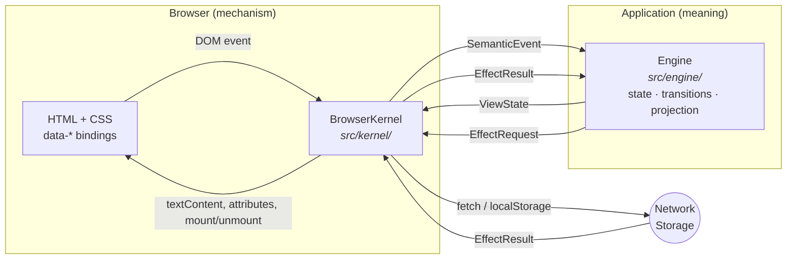

# TypeScript WASM Kernel

A small browser kernel that moves application logic *out* of JavaScript.

Your HTML stays HTML. Your CSS stays CSS. The browser keeps doing its own
rendering. JavaScript shrinks to one job — carrying browser events in and
browser effects out — and everything that decides what the application
*means* lives behind a single narrow, serializable boundary.

```sh
npm install @echelon-foundry/typescript-wasm-kernel
```

---

## Read this first: where is the WebAssembly?

**There is no WebAssembly in this repository today.** Not a `.wasm` file, not a
loader, not a `WebAssembly.instantiate` call. If you came looking for one, that
is why you could not find it.

The name describes the *boundary*, not the current implementation:

- The kernel talks to your application through one interface,
  [`EngineTransport`](src/protocol.ts) — `start()` and
  `dispatch(message) → response`.
- Every message across it is plain, JSON-serializable data. No functions, no
  DOM nodes, no object identity, no shared memory.
- That is exactly the shape a WebAssembly module can be driven through. Swap
  the transport and the kernel does not change.

Today the only shipped transport is `DirectTypeScriptTransport`, which runs a
TypeScript engine in-process. The term used throughout these docs for "the
thing that owns application meaning" is **the engine**, and the engine is
TypeScript right now.

So: the kernel is *WASM-ready*, not WASM-powered.
[docs/17-wasm-migration.md](docs/17-wasm-migration.md) spells out precisely what
exists, what does not, and what a real WASM transport would have to do.

---

## Why this exists

Most browser applications end up with the same problem: the truth about what
the application is doing gets smeared across three places — a JavaScript store,
the DOM itself, and the server. Each one can disagree with the others, and no
single file tells you which is right.

This architecture takes a different position: **exactly one place owns
application state, and it is not the browser.**

What that buys you, and why:

| Benefit | Why it follows |
| --- | --- |
| One source of truth | Application state exists only inside the engine. The DOM is output, never input. |
| Illegal states are unrepresentable | State is a discriminated union, so "saving *and* already saved" cannot be written down. |
| Deterministic transitions | `(state, command) → state` is a pure function, testable without a browser. |
| Honest failure | Every external effect reports `Success`, `Failure`, `Cancelled`, or `OutcomeUnknown`. "We don't know" is a real, handled outcome. |
| Portable logic | The engine touches no browser API, so it can be ported to another language without rewriting behavior. |
| Less to audit | Browser access lives in one file. A mechanical check fails the build if it leaks. |
| Easier for agents | There is one correct place for any given change, and it can be named in a rule. |

These are consequences of the boundary, not aspirations. The one that is
*enforced by a script* is the last-but-one:
[`scripts/check-architecture.ts`](scripts/check-architecture.ts) fails the build
if `src/engine/**` so much as mentions `document`, `window`, `fetch(`,
`localStorage`, or `sessionStorage`.

## The core idea

```text
HTML          owns document structure.
CSS           owns presentation.
The browser   owns layout, rendering, and native input behavior.
The kernel    is a thin, generic bridge: it moves events in and effects out.
The engine    owns state, transitions, validation, and what to show.
```

The kernel understands six HTML attributes and **no** application vocabulary.
It does not know what `"checkAvailability"` means, or what a `"customers"` list
is. It moves opaque strings and plain data across a boundary.

## Thirty-second architecture



The two arrows crossing the middle are the entire contract. They are defined in
[`src/protocol.ts`](src/protocol.ts), which is about 80 lines and is the single
most useful file to read.

## The smallest working example

Three files. Nothing is elided.

**`index.html`** — structure and bindings:

```html
<button data-event="increment">Add one</button>
<button data-event="reset" data-bind-disabled="resetDisabled">Reset</button>
<p>Count: <span data-text="count">0</span></p>

<script type="module" src="./main.js"></script>
```

**`engine.ts`** — all the meaning:

```ts
import type { BrowserToEngineMessage, EngineToBrowserMessage, EngineTransport, ViewState }
  from "@echelon-foundry/typescript-wasm-kernel/protocol";

type State = { readonly count: number };

// Pure. No DOM, no fetch, no globals.
const transition = (state: State, name: string): State => {
  switch (name) {
    case "increment": return { count: state.count + 1 };
    case "reset":     return { count: 0 };
    default: throw new Error(`Unrecognized event: ${name}`);
  }
};

// Pure. Produces what the view needs — including whether Reset is *allowed*.
const project = (state: State): ViewState => ({
  count: state.count,
  resetDisabled: state.count === 0,
});

export function createCounterTransport(): EngineTransport {
  let state: State = { count: 0 };
  return {
    async start() {},
    async dispatch(message: BrowserToEngineMessage): Promise<EngineToBrowserMessage> {
      if (message.kind === "Event") state = transition(state, message.event.name);
      return { view: project(state), effects: [], cancellations: [] };
    },
  };
}
```

**`main.ts`** — the wiring, in full:

```ts
import { BrowserKernel } from "@echelon-foundry/typescript-wasm-kernel";
import { createCounterTransport } from "./engine.js";

await new BrowserKernel(createCounterTransport(), document).start();
```

That is the whole mechanism. A click on the first button becomes
`SemanticEvent { name: "increment" }`, `transition` returns a new state,
`project` turns it into `{ count: 1, resetDisabled: false }`, and the kernel
writes `1` into the `<span>` and enables the button.

Note `resetDisabled`. The engine decides whether Reset is available; the DOM
never re-derives it from the number on screen. That habit — **project
capabilities, don't reconstruct them** — is most of what using this well
consists of.

This example is real and is executed by the test suite on every run:
[`examples/01-counter/`](examples/01-counter/).

## Run it

```sh
npm install
npm run check        # build + architecture check + docs check + 68 tests
npm run build
npm run build:examples
python3 -m http.server 4173
```

Then open:

- <http://localhost:4173/> — the reference feature (email availability)
- <http://localhost:4173/examples/01-counter/> — and `02-form`, `03-fetch-data`,
  `04-save-data`, `05-multi-screen`, `06-time-entries`
- <http://localhost:4173/examples/kitchen-sink.html> — every bridge primitive
  and every effect outcome on one page

The network-backed examples call endpoints that do not exist without a backend.
That is deliberate: they demonstrate the typed failure states.

## Where to go next

| You are… | Start here |
| --- | --- |
| New to the project | [docs/01-architecture.md](docs/01-architecture.md) |
| Building your first app | [docs/02-getting-started.md](docs/02-getting-started.md) |
| **An AI coding agent** | [AGENTS.md](AGENTS.md), then [docs/14-agent-guide.md](docs/14-agent-guide.md) |
| Looking for a specific API | [docs/11-api-reference.md](docs/11-api-reference.md) |
| Trying to do one task | [docs/15-recipes.md](docs/15-recipes.md) |
| Debugging something | [docs/16-troubleshooting.md](docs/16-troubleshooting.md) |
| Adopting this in another app | [docs/10-integration-guide.md](docs/10-integration-guide.md) |
| Wondering about WASM | [docs/17-wasm-migration.md](docs/17-wasm-migration.md) |

Full index: **[docs/README.md](docs/README.md)**.

## Requirements and compatibility

- **Node** ≥ 22 (for building and testing; the published package is browser code)
- **TypeScript** ≥ 5.9 if you consume the types
- **Browsers**: any with ES2022 modules, `fetch`, and `AbortController`
- **Runtime dependencies**: none. The kernel imports nothing at runtime.
- **Versioning**: semver, currently `0.x` — the protocol may still change in a
  minor release. See [docs/11-api-reference.md](docs/11-api-reference.md#stability-and-compatibility).

## Contributing

Start with [CLAUDE.md](CLAUDE.md) (working rules) and
[docs/12-design-rules.md](docs/12-design-rules.md) (the architectural
constraints, stated as MUST/SHOULD/MAY).

Known gaps, deferred work, and the reasoning behind both are tracked honestly in
[docs/ROADMAP.md](docs/ROADMAP.md) and
[docs/DOCUMENTATION-AUDIT.md](docs/DOCUMENTATION-AUDIT.md).

## Publishing

CI builds, tests, and validates the npm tarball on every push and pull request.
Publishing is triggered by a semantic-version tag and authenticates with npm
Trusted Publishing over GitHub OIDC — no npm token is stored in GitHub.

Configure the package's **Trusted Publisher** on npmjs.com with:

- Provider: GitHub Actions
- Organization or user: `kemiller2002`
- Repository: `typescript-wasm-kernel`
- Workflow filename: `publish.yml`
- Environment: leave empty
- Allowed action: `npm publish`

Then:

1. Update the version with `npm version patch` (or `minor`/`major`).
2. Push the commit and tag with `git push --follow-tags`.

The publish workflow rejects a tag whose version does not match `package.json`,
then runs all checks before publishing. Package version `0.2.1` must be released
with tag `v0.2.1`.

## License

MIT — see [LICENSE](LICENSE).
