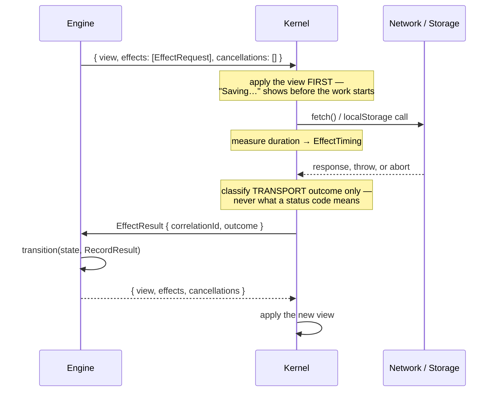

# Effects and browser interop

**What this answers:** how anything leaves the application — network calls,
storage, and every other browser capability — and what happens when it fails.

This document covers network requests in full; there is no separate networking
page.

---

## Decision vs. effect

The distinction the whole design rests on:

| | Pure application decision | External effect |
| --- | --- | --- |
| Example | "this email is invalid" | "ask the server if it's taken" |
| Who does it | the engine, in `transition()` | the kernel, on the engine's request |
| Repeatable? | yes, identically, forever | no — it touches the world |
| Testable without a browser? | yes | the *request* is; the execution isn't |
| Can it fail? | no | **yes, in four distinct ways** |

The engine may compute anything. It may not *do* anything. To act on the world
it returns a description of the act and waits to be told what happened.

### Why not just call `fetch`?

If a transition could call `fetch`, four things break at once:

1. **Purity.** `transition()` stops being testable without a network.
2. **Visibility.** External interactions hide inside arbitrary functions instead
   of appearing at the boundary.
3. **Portability.** The engine gains a browser dependency and can no longer be
   ported to WebAssembly or another language.
4. **Failure handling.** Nothing forces you to handle the failure cases. Making
   the outcome a typed input means the compiler does.

That last one is the practical payoff. `OutcomeUnknown` is easy to skip when
failures are exceptions; it is impossible to skip when it is a union member you
must switch on.

---

## The full round trip



An effect result is a **separate round trip**, not a return value. One user
action commonly repaints twice: once for "in progress", once for the outcome.

---

## What the kernel can actually do

Four capabilities. It announces them at startup in
`Initialize.capabilities: ["Http", "Storage", "Clipboard", "Navigation"]`.

| Capability | Status | Covered below |
| --- | --- | --- |
| Http (`fetch`) | ✅ implemented | yes |
| Storage (`localStorage`) | ✅ implemented | yes |
| Clipboard (write) | ✅ implemented | yes — and [clipboard.md](clipboard.md) |
| Navigation (history, URL) | ✅ implemented | yes — and [routing.md](routing.md) |
| Clipboard **read** | ❌ deliberately absent | [clipboard.md](clipboard.md#write-only-deliberately) |
| `sessionStorage`, `IndexedDB`, Cache API | ❌ not implemented | — |
| Files (read, download, upload) | ❌ not implemented | — |
| Timers, `requestAnimationFrame`, idle callbacks | ❌ not implemented | — |
| Focus control | ❌ not implemented | — |
| Geolocation, notifications, media, observers | ❌ not implemented | — |

### Capabilities are not permissions

`Initialize.capabilities` says what the **kernel implements**. It is not a
statement about what this browser will permit when the effect actually runs: a
clipboard write can still be `denied`, `localStorage` can still be `unavailable`
in a private window, and `history` can be missing in an exotic embedding.

Permission and availability are reported **per effect, in that effect's own
outcome**, never by withholding the capability. This keeps an engine's startup
branch from silently changing between browsers — and it means you should not
use the capability list to pre-disable a control. Whether a copy works is only
knowable by trying.

**If it is not in the first four rows, the engine cannot do it.** These are not
oversights: this repository treats building a capability before a feature needs
it as an architecture violation in its own right (ROADMAP's 🧊 legend), because
it produces untested surface with no design pressure behind it. Adding one is a
deliberate, small, documented change — see
[15-recipes.md](15-recipes.md#add-a-new-browser-capability).

Each capability has **its own outcome type**, rather than sharing one. A
`StorageOutcome` has no `Cancelled`, because a synchronous local call cannot be
cancelled; a `ClipboardOutcome` has no `OutcomeUnknown`, because a refused write
did not happen. A shared outcome type would force every caller to handle
variants that cannot occur, and every one of those branches would be untestable
and eventually wrong.

---

## Http

### Request

```ts
type HttpEffectRequest = {
  kind: "Http";
  correlationId: CorrelationId;
  method: "GET" | "PUT" | "POST" | "PATCH" | "DELETE";
  url: string;
  headers?: Readonly<Record<string, string>>;
  body?: string;              // pre-serialized BY YOU; the kernel never interprets it
  timeoutMs: number;          // required
};
```

- **`correlationId`** — your identifier for this request. The result quotes it
  back. Keep it in the state that is waiting on it.
- **`body`** — already a string. The engine does its own `JSON.stringify`. The
  kernel passes it to `fetch` untouched and does not know or care what it is.
- **`headers`** — merged over the kernel's default `accept: application/json`;
  yours win on conflict.
- **`timeoutMs`** — required, no default. After it elapses the request is
  aborted and reported as `OutcomeUnknown`.

```ts
const effect: EffectRequest = {
  kind: "Http",
  correlationId,
  method: "POST",
  url: "/api/notes",
  headers: { "content-type": "application/json" },
  body: JSON.stringify({ text }),
  timeoutMs: 5000,
};
```

### Outcome

```ts
type EffectOutcome =
  | { kind: "Success";        status: number; body: unknown }
  | { kind: "Failure";        reason: "network" | "aborted" | "invalid-response"; status?: number }
  | { kind: "Cancelled" }
  | { kind: "OutcomeUnknown"; reason: "timeout-after-dispatch" };
```

`status` is present exactly when a response was received — so on
`invalid-response`, never on `network`/`aborted`. Its absence means nothing came
back.

| Outcome | Means | Typically |
| --- | --- | --- |
| `Success` | a response arrived and its body parsed as JSON | check `status`, then decode `body` |
| `Failure { network }` | `fetch` threw — DNS, offline, CORS | retryable |
| `Failure { invalid-response, status }` | responded, but the body was not JSON | depends on `status`: a 5xx error page is often retryable, a malformed 200 never is |
| `Failure { aborted }` | aborted for a reason that was neither cancel nor timeout | rare |
| `Cancelled` | the engine asked for this | usually return to the prior state |
| `OutcomeUnknown` | timed out **after dispatch** | see below — this is the important one |

#### `Success` does not mean the server agreed

A 404, a 422, and a 500 are `Success` **provided their bodies parse as JSON**.
The kernel received a response; it does not decide what a status code means,
because that is domain-specific — a 404 from a lookup may be a normal "not
found", and from a save it is a bug.

> **In practice most error responses are not JSON.** Servers return HTML error
> pages, so a 404 usually arrives as
> `Failure { reason: "invalid-response", status: 404 }`, not as a `Success`.
> Check `status` on the failure branch too, or you will treat "the server
> refused" as "the payload was malformed":
>
> ```ts
> case "Failure": {
>   if (command.outcome.reason === "network") return retryable("Could not reach the server.");
>   // A response arrived but would not decode. The status says which case this is.
>   if (command.outcome.status !== undefined && command.outcome.status !== 200) {
>     return { kind: "Rejected", reason: `Server answered ${command.outcome.status}.`, retryable: command.outcome.status >= 500 };
>   }
>   return { kind: "Rejected", reason: "The response was not valid JSON.", retryable: false };
> }
> ```

```ts
case "Success":
  if (command.outcome.status !== 200) return failed(`Server returned ${command.outcome.status}.`);
  const decoded = decodeCustomers(command.outcome.body);   // body is `unknown`
  return decoded === null ? failed("Unexpected response shape.") : loaded(decoded);
```

`body` is typed `unknown` on purpose. The kernel parsed JSON; it validated
nothing. Narrow it explicitly — see `decodeCustomers` in
[`examples/03-fetch-data/engine.ts`](../examples/03-fetch-data/engine.ts).

#### `OutcomeUnknown` is not a failure

A timeout fires after `fetch` has already sent the request. The server may have
processed it. The kernel cannot know, so it refuses to guess — reporting a
confident `Failure` would be a lie.

**What to do depends entirely on the method, and only the engine knows:**

```ts
// GET — idempotent. Retrying is free.
case "OutcomeUnknown":
  return { state: { kind: "LoadOutcomeUnknown" }, effects: [] };   // offer retry
```

```ts
// POST — not idempotent. Retrying may create a second record.
case "OutcomeUnknown":
  return { state: { kind: "SaveOutcomeUnknown", text: state.text }, effects: [] };
  // → project needsReconciliation, and deliberately NO retry button
```

Both are in the examples and both are asserted by the test suite:
[03-fetch-data](../examples/03-fetch-data/) keeps retry available;
[04-save-data](../examples/04-save-data/) removes it and asks the user to
reload and check. Same kernel outcome; opposite correct responses.

Collapsing `OutcomeUnknown` into `Failure` is the most consequential modeling
mistake available here. It is how duplicate orders get created.

### Cancellation

The engine names correlation IDs it no longer wants:

```ts
return { view, effects: [], cancellations: [inFlightCorrelationId] };
```

The kernel aborts the matching in-flight request, and the result comes back as
`{ kind: "Cancelled" }` through the **ordinary** `EffectResult` path. Handle it
as evidence, not as a special control-flow case.

Naming an ID that has already completed is a harmless no-op. There is no error,
and none is needed.

### Secrets

The kernel never puts `headers` or `body` into any `DiagnosticEvent` — only
`correlationId` and timing. Headers routinely carry credentials. This is
enforced by test (`test/kernel.test.ts`: "a diagnostics sink never receives
request headers or body").

**If you write your own `DiagnosticsSink`, preserve that.** Do not log whole
`EffectRequest` objects.

---

## Storage

`localStorage` only. No `sessionStorage`, no `IndexedDB`.

```ts
type StorageEffectRequest =
  | { kind: "Storage"; correlationId; operation: "get";    key: string }
  | { kind: "Storage"; correlationId; operation: "set";    key: string; value: string }
  | { kind: "Storage"; correlationId; operation: "remove"; key: string };

type StorageOutcome =
  | { kind: "Success"; value: string | null }
  | { kind: "Failure"; reason: "unavailable" | "quota-exceeded" };
```

- **`value` is the read value for `get`** — `null` means the key was absent,
  which is a normal outcome, not a failure. For `set`/`remove` it is `null` and
  unused.
- **`unavailable`** — storage is disabled or inaccessible (private browsing,
  blocked cookies, a sandboxed frame).
- **`quota-exceeded`** — the store is full.

### Two things differ from Http

**There is no `OutcomeUnknown`.** A single `localStorage` call is effectively
atomic, so there is no "dispatched but uncertain" state to represent.

**Cancellation is meaningless.** The operation completes synchronously inside
its own effect execution, so by the time any later response could name its
`correlationId`, it has already finished and reported. Naming it is a no-op.

### Pattern: a best-effort local draft

```ts
case "RestoreDraft": {
  // A missing draft and an unreadable store land in the same place: an empty
  // editor. Losing a local convenience must not block the feature.
  const restored = command.outcome.kind === "Success" ? command.outcome.value ?? "" : "";
  return { state: { kind: "Editing", text: restored, savedText: "" }, effects: [] };
}
```

Full version: [`examples/04-save-data/`](../examples/04-save-data/), which
reads a draft at startup, writes on every edit, and clears it once the server
has the content.

**Do not put anything sensitive in `localStorage`.** It is readable by any script
on the origin and persists indefinitely.

---

## Clipboard

Full guide, including the browser rules you cannot engineer around:
**[clipboard.md](clipboard.md)**. The shape:

```ts
type ClipboardEffectRequest = {
  kind: "Clipboard";
  correlationId: CorrelationId;
  operation: "writeText";     // write-only, deliberately
  text: string;               // never surfaced in a DiagnosticEvent
};

type ClipboardOutcome =
  | { kind: "Success" }
  | { kind: "Failure"; reason: "denied" | "unavailable" | "unknown" };
```

Three things differ from Http:

1. **Success carries no payload.** The write happened or it did not.
2. **There is no `OutcomeUnknown`.** A refused write did not occur; there is no
   "dispatched but uncertain" case to represent.
3. **`denied` is the only retryable failure.** Browsers grant clipboard access
   while a user gesture is fresh, so clicking again often works.
   `unavailable` means no Clipboard API exists here, and never will this
   session — telling a user to retry it is advice that cannot succeed.

There is no `readText`, on purpose: it would let an engine pull whatever the
user last copied across the boundary on its own initiative.

---

## Navigation

Full guide, including deep links, base paths and static hosting:
**[routing.md](routing.md)**. The shape:

```ts
type NavigationEffectRequest =
  | { kind: "Navigation"; correlationId; operation: "push";    url: string }
  | { kind: "Navigation"; correlationId; operation: "replace"; url: string }
  | { kind: "Navigation"; correlationId; operation: "back" }
  | { kind: "Navigation"; correlationId; operation: "forward" };

type NavigationOutcome =
  | { kind: "Success"; location: BrowserLocation }   // push/replace: where the browser ended up
  | { kind: "Dispatched" }                           // back/forward: asked, not yet moved
  | { kind: "Failure"; reason: "unavailable" | "not-same-origin" };
```

Navigation is the one capability that also produces a message **nobody
requested**:

```ts
| { kind: "LocationChanged"; location: BrowserLocation }
```

The browser moved on its own — Back, Forward, or a gesture that does the same
thing. It is not an `EffectResult`, because no effect was asked for and nothing
correlates it. An engine that ignores it still compiles and still works; it
simply will not react to the Back button.

`Initialize` carries the URL the page was loaded at, for the same reason: a
routing engine should pick its first screen from the address bar rather than
defaulting and then correcting itself.

Two rules that are easy to get wrong:

- **Never request a navigation in response to `LocationChanged`.** The browser
  has already moved. Pushing again traps the user on the page.
- **`back`/`forward` report `Dispatched`, not `Success`.** They only ask. If
  there is nowhere to go, no `LocationChanged` ever arrives, and that is a
  correct outcome rather than a lost message.

Cross-origin URLs are refused with `not-same-origin` and the page does not move.
Leaving the origin ends the application and discards all engine state; an
ordinary `<a href>` is the right tool for that, and needs no capability.

---

## Requesting effects from `Initialize`

Startup work is an ordinary effect request. The response to `Initialize` may
carry effects, and the initial projection renders before they run:

```ts
case "Initialize":
  return {
    view: project(state),                       // renders "Loading…" immediately
    effects: [{ kind: "Storage", correlationId: DRAFT_GET, operation: "get", key: DRAFT_KEY }],
    cancellations: [],
  };
```

[`examples/06-time-entries/`](../examples/06-time-entries/) issues its initial
`GET` here, which is why its list loads with no user interaction.

---

## Multiple effects

All effects in one response run **concurrently** (`Promise.all`). Each produces
its own independent `EffectResult` round trip, in completion order — which is
not necessarily request order.

**The kernel never orchestrates.** No sequencing, no retries, no batching, no
combining. If you need B only after A succeeds, request A, and request B when
A's result arrives. Retry policy is likewise the engine's: re-request the effect
from the failure state.

---

## Effects and diagnostics

Every effect is timed and reported:

```ts
type DiagnosticEvent =
  | { kind: "BridgeError";  phase: "dispatch" | "projection" | "effect"; detail: string }
  | { kind: "EffectTiming"; correlationId: CorrelationId; durationMs: number };
```

```ts
const kernel = new BrowserKernel(transport, document, {
  report(event) {
    if (event.kind === "EffectTiming" && event.durationMs > 1000) {
      console.warn("slow effect", event.correlationId, event.durationMs);
    }
  },
});
```

Diagnostics are strictly a bridge concern. Never route them into engine or view
state — that would make debugging instrumentation part of the application's
meaning.

---

## Common mistakes

| Mistake | Why it's wrong | Instead |
| --- | --- | --- |
| Calling `fetch` in the engine | breaks purity, portability, and the build | return an `EffectRequest` |
| Treating a 500 as a failure outcome | it's `Success` — the kernel got a response | check `outcome.status` yourself |
| Folding `OutcomeUnknown` into `Failure` | causes duplicate writes | represent it separately |
| Retrying a timed-out POST automatically | it may already have succeeded | reconcile, don't repeat |
| Trusting `outcome.body` | it's `unknown`; nothing validated it | narrow it explicitly |
| Forgetting the stale-result guard | an old response overwrites a newer one | compare `correlationId` |
| Omitting `timeoutMs` | it's required | pick one |
| Logging the whole `EffectRequest` | headers carry credentials | log `correlationId` only |
| Expecting cancellation to skip the result | it always reports | handle `Cancelled` |

---

## Related

- [03-kernel-lifecycle.md](03-kernel-lifecycle.md) — where effects run in the round trip
- [04-state-model.md](04-state-model.md) — holding a `correlationId` in state
- [11-api-reference.md](11-api-reference.md) — exact type signatures
- [15-recipes.md](15-recipes.md) — calling an API, storing locally, adding a capability
